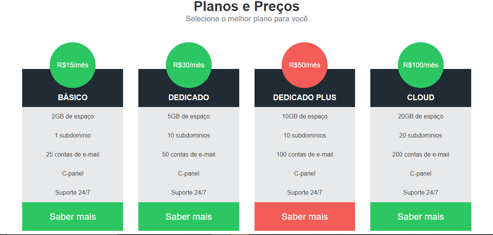

# Revisão de HTML e CSS.

> Projetos básicos desenvolvidos com HTML e CSS.

Esse repositório armazena alguns projetos simples desenvolvidos com as tecnologias HTML e CSS.

Exemplos de projetos desenvolvidos:

Exemplo 01:

Exemplo 02:

Exemplo 03:

Exemplo 04:

Exemplo 05:

Exemplo 06:

Exemplo 07:

## Tecnologias
- HTML
- CSS
- Git e GitHub